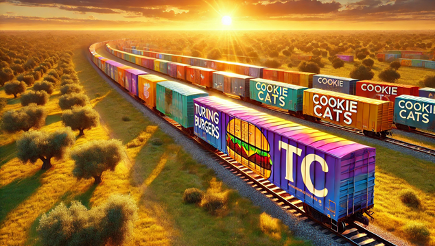

 
This is a README file for double project at Turing
DS Module 2 Sprint 2

### Description
In this sprint learners were required to analyze two datasets.
Each of the datasets should be in a separate notebook.
As the datasets are not related, the notebooks and project related files
are placed in separate folders, which can be found in this folder.

However, both projects share most of the dependencies, which
are described in common for both projects file "requirements.txt".

### Contents of this folder
Folder "Cookie_Cats" - project dedicated
Folder "Fast_Food_Promo" - project dedicated
Folder "images" - decorative purposes
File "requirements.txt"
File "LICENSE.txt"
This README.md file