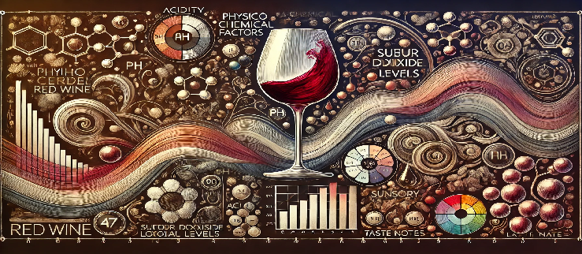

 
# VINHO VERDE TINTO - AN EXPLANATORY MODEL

## IMPORTANT NOTICE
<i>For plotting plotly libraries are used throughout this project. As interactive plotly plots
are not available for preview at github, static images have been generated for preview and
embedded in the notebook (render_mode in the first cell of the notebook has been set to 'github').
For viewing of interactive plots it is adviced to clone this repository, follow the dependencies, 
listed in the 'requirements.txt' file (available in the project folder), open the notebook,
change the render_mode to 'interactive' and run 'Restart Kernel and Run All Cells' from the
jupyter menu.

Happy reading!</i>

## About the Project
This project provides the reader with thorough and comprehensive Exploratory Data Analysis (EDA)
of physicochemical measurements in combination with information from domain. Based on the results
of EDA an explanatory model is constructed, explaining how the data from precise measurements
can impact the wine's quality - an evaluation derived from sensoric data.

## Conclusions
Although the target variable (quality) might seem inherently subjective due to its sensory nature,
the model, constructed using independent variables derived from physicochemical measurements,
performs relatively well. There is, however, room for improvement in the performance for extreme
quality classes, which are underrepresented, leading to dataset imbalance.

Outliers are relatively prevalent, with 340 of 1,359 rows (25%) containing at least one outlier.
This prevalence is partially explained by the fact that some outliers fall within industry-acceptable
boundaries.

## Suggestions
Despite some outliers falling within industry-acceptable boundaries, further investigation remains
highly relevant. However, the limited sample size and class imbalance could introduce potential bias
into the results. A more extensive and balanced dataset would support a thorough analysis and significantly
improve the stability and performance of the model in predicting wine quality.

## Versions of Python and Libraries Used
python==3.12.5
kaleido==0.1.0.post1
matplotlib==3.9.2
numpy==2.1.2
pandas==2.2.3
plotly==5.24.1
scikit-learn==1.5.2
scipy==1.14.1
statsmodels==0.14.4

## Contents Of Project Folder
- 'data' folder with dataset
- 'helpers' folder with helper functions
- 'images' folder with images relevant for the project
- 'red_wine_quality_model.ipynb' file with the project itself
- 'requirements.txt' file with list of dependencies
- 'LICENsE.txt' file containing license description
- 'README.md' - this file

## License
Please refer to LICENSE.txt
